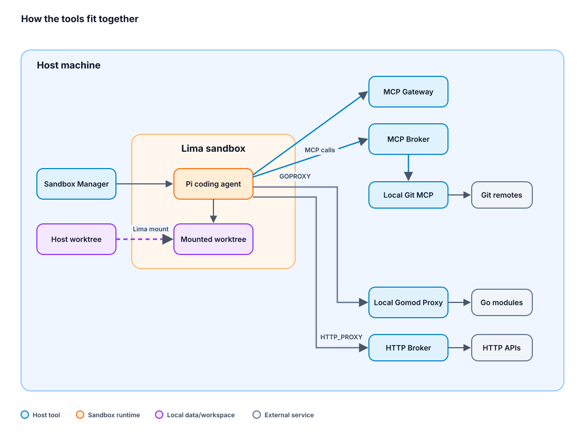

# Agent Tools

[](https://github.com/averycrespi/agent-tools/actions/workflows/ci.yml)

My tools for working with AI coding agents. Pairs well with my [agent-config](https://github.com/averycrespi/agent-config).

This repo is opinionated. It provides sandboxed execution and broker-backed external access that make coding agents safer and easier to run day to day. Use it as-is, fork it, or cherry-pick the tools that fit your setup.

## Overview

- **[Sandbox Manager](#sandbox-manager-sb)** — Manage a Lima VM sandbox for isolated agent environments
- **[MCP Broker](#mcp-broker)** — Proxy that lets sandboxed agents use external tools without holding secrets
- **[MCP Gateway](#mcp-gateway)** — Locally secure, deny-by-default MCP service foundation
- **[HTTP Broker](#http-broker)** — MITM HTTP/HTTPS forward proxy that injects credentials for sandboxed agents
- **[Local Git MCP](#local-git-mcp)** — Stdio MCP server for authenticated git remote operations
- **[Local Gomod Proxy](#local-gomod-proxy)** — Host-side Go module proxy for sandboxed agents
- **[Telegram MCP](#telegram-mcp)** — Minimal stdio MCP server for sending Telegram notifications

## How the Tools Fit Together



## Getting Started

Requirements:

- Go 1.25+
- Node.js and npm for development hooks and document formatting
- GNU Make
- Python 3 for CI selection and gate tests
- macOS for `sandbox-manager` (requires Lima)

```bash
# First-time setup on macOS: install Homebrew deps, dev deps/hooks, and all Go tools
make setup

# Or run the steps separately
brew bundle       # macOS system dependencies
make install-dev  # npm install for formatter deps and Git hooks
make install      # install all Go tool binaries

# Verify formatting, linting, and unit tests
make check

# Run the CI classifier tests and broader suites locally
make test-ci
make test-integration
make test-e2e
make vulncheck

# Or, to install individual tools
cd sandbox-manager && make install
cd mcp-broker && make install
cd mcp-gateway && make install
cd http-broker && make install
cd local-git-mcp && make install
cd local-gomod-proxy && make install
cd telegram-mcp && make install
```

## CI

Pull requests run Go lint, unit tests, supported integration/E2E suites, and blocking Go vulnerability scans in independent tool-scoped jobs. Gateway lint runs independently of its unit, integration, E2E, and temporary-runner leaves, without repeating integration under the unit job. Both Gateway lint and correctness remain mandatory in Required. Sandbox Manager retains its macOS unit tests. Formatting and CI selection/gate tests always run.

Any file under a tool selects that tool, including docs, fixtures, and scripts. Tool-level Makefiles, module dependencies, and linter configuration also select Gateway because its acceptance tests inspect those definitions. Root/shared files and unknown paths select every tool. PR selection uses the merge-base diff and includes deleted files and both sides of renames. Pushes to `main`, manual runs, and the weekly scheduled run check every tool; scheduled vulnerability scans can catch new advisories without code changes.

Configure branch protection to require the stable **Required** check from the **CI** workflow rather than individual matrix jobs. When migrating from the old workflow, replace the old Unit tests (Linux), Integration tests, End-to-end tests, and Vulnerability scan requirements; conditional Sandbox Manager checks should also be covered by Required. The gate rejects failed, cancelled, missing, or unexpectedly skipped checks. Repository commits do not update GitHub branch-protection settings.

Go module, build, and linter caches are owned by tool and execution role, with workspace/module dependencies, linter configuration, resolved toolchain, OS, and architecture in the compatibility identity. Each workflow run/attempt saves under a fresh key while restoring the latest compatible entry, so an incomplete restore can acquire and retain missing material. Build caches may span source revisions; they never replace exact-head correctness checks. Role isolation trades some cache duplication for independent writers and avoids a lint or ordinary-test cache blocking E2E material from being saved.

Run `make test-ci` to verify classification, merge-base handling, required-gate policy, cache identity, and workflow wiring locally. Actual cache-hit effectiveness, runner cost, and critical-path timing require authorized CI execution; local tests do not simulate GitHub's cache service. Tool inventories come from the root Makefile. This CI profile is development feedback, not Gateway's complete [exact-revision release acceptance](mcp-gateway/docs/maintainers/release-verification.md).

## Tools

### Sandbox Manager (sb)

Running AI agents with full host access is risky — one bad command can trash your environment. Containers help, but they're optimized for application isolation, not interactive development. What you want is a full VM that feels like a real development machine, is cheap to create and destroy, and can be provisioned to match your workflow.

`sb` wraps Lima to manage a lightweight Linux VM on macOS:

- `sb create` spins up a provisioned Ubuntu VM with a host-matching UID, writable mounts, and any tools your provisioning scripts install.
- `sb shell` drops you in.
- `sb provision` re-provisions a running VM.
- `sb destroy` tears it down.

The sandbox protects host integrity and credential custody; it is not a data-loss-prevention boundary. Guest network egress is intentionally allowed by default, so keep secrets and sensitive private data out of the VM unless you accept that the agent can transmit them.

See the [sandbox-manager README](sandbox-manager/README.md) for more information.

### MCP Broker

AI agents need to call external APIs (GitHub, Jira, Slack), but giving a sandboxed agent credentials or direct MCP access defeats the point of the sandbox. What you want is a single broker that holds the credentials, enforces policy on every tool call, and gives you a place to see and approve what the agent is doing.

`mcp-broker` runs on the host, holds the secrets, and exposes backend MCP servers through a single endpoint:

- The user connects their individual MCP servers to the MCP Broker.
- Agents connect to the broker as their only MCP server, with no secrets exposed to the agent.
- Rules control which MCP tools are auto-allowed, auto-denied, or sent for human approval.
- Every tool call is audit-logged in SQLite for maximum observability.
- A web dashboard handles approval requests in real time and surfaces the configured rules, discovered tools, and searchable audit log.

See the [mcp-broker README](mcp-broker/README.md) for more information.

### MCP Gateway

`mcp-gateway` is a locally secure, deny-by-default service for governing MCP access. It combines a strict loopback HTTP/MCP boundary with dynamic downstream runtimes and catalogs, principal credentials and grants, governed tool invocation, bounded redacted evidence, browser and CLI administration, and verified recovery.

Gateway permits at most one automatic authorized attempt and never queues or automatically replays a tool call. Uncertain handoff remains explicit because an effect may already have occurred. Start with the [Gateway README](mcp-gateway/README.md), then use the [documentation map](mcp-gateway/docs/README.md) to find operator and maintainer procedures or [DESIGN](mcp-gateway/DESIGN.md) for normative behavior and security boundaries.

### HTTP Broker

`mcp-broker` keeps secrets out of the sandbox for MCP tool calls. An agent that reaches for `curl`, an SDK, or any ordinary HTTP client is back to holding its own.

`http-broker` applies the same premise to raw HTTP. It is a host-native forward proxy that decides per connection whether to intercept, tunnel, or deny, injects credentials the sandbox never holds, and records every request to an audit log surfaced through a read-only dashboard.

```json
{
  "name": "github-issues",
  "host": "api.github.com",
  "path": "/repos/*/*/issues",
  "mode": "intercept",
  "inject": { "set": { "Authorization": "Bearer ${cred.gh_bot}" } }
}
```

Every credential carries bound hosts, so a rule-authoring slip cannot send a token somewhere it does not belong.

Enforcement is **cooperative** — it rests on the sandbox honouring `HTTP_PROXY`/`HTTPS_PROXY`, so it is not a containment boundary. See the [http-broker README](http-broker/README.md) and its [security model](http-broker/docs/security-model.md) for what it does and does not guarantee.

### Local Git MCP

Sandboxed agents can do most git operations locally — staging, committing, diffing, rebasing — because those don't need authentication. But pushing, pulling, and fetching require credentials that the sandbox intentionally doesn't have. What you want is a host-side helper that performs just the credentialed operations on the agent's behalf, without ever exposing your SSH keys or credential store to the sandbox.

`local-git-mcp` is a stdio MCP server that runs on the host and shells out to the user's existing `git` setup:

- Six tools — `push`, `pull`, `fetch`, `clone_github_repo`, `list_remote_refs`, and `list_remotes` — cover every remote operation an agent typically needs.
- Uses the host's existing SSH keys and credential helpers; no tokens or keys ever cross into the sandbox.
- Designed to sit behind `mcp-broker`, so the broker's rules and audit log apply to every push and pull.
- No config, no state, no network listener — spawned as a subprocess over stdio.

See the [local-git-mcp README](local-git-mcp/README.md) for more information.

### Local Gomod Proxy

Sandboxed agents often work in Go projects that depend on private modules hosted in private GitHub repositories. On the host, those dependencies resolve transparently via the user's git credentials. Inside the sandbox, those credentials are intentionally absent — so `go mod download` fails for any private dependency.

`local-gomod-proxy` is a minimal HTTP Go module proxy that runs on the host and bridges the gap:

- Public modules are reverse-proxied to `proxy.golang.org` with zero host CPU overhead.
- Private modules (matched by `GOPRIVATE`) are fetched via `go mod download` on the host, inheriting its git credentials, and streamed back to the sandbox.
- Git credentials stay on the host; the sandbox reaches the proxy over Lima's host-local bridge and carries none.

See the [local-gomod-proxy README](local-gomod-proxy/README.md) for more information.

### Telegram MCP

Agents sometimes need a direct way to notify the human operator when work finishes or attention is needed. The broker's Telegram integration is for approval requests; `telegram-mcp` is a separate, minimal stdio MCP server for agent-to-human notifications.

`telegram-mcp` sends text messages to one configured Telegram chat:

- Exposes a single MCP tool, `send_message`, for notifications.
- Uses its own Telegram bot token and chat ID; credentials stay on the host.
- Designed to sit behind `mcp-broker`, so broker rules and audit logging still apply.
- No general Telegram client features — no arbitrary recipients, media upload, receiving messages, or chat administration.

See the [telegram-mcp README](telegram-mcp/README.md) for more information.

## Deprecated Tools

These tools are no longer maintained, but their final versions remain available in the repository history.

| Tool                  | Last commit                                                                                                                  | Reason                                                              |
| --------------------- | ---------------------------------------------------------------------------------------------------------------------------- | ------------------------------------------------------------------- |
| `worktree-manager`    | [`20b0fb924c`](https://github.com/averycrespi/agent-tools/tree/20b0fb924c97b2058e181ce08f721214bbf80e5c/worktree-manager)    | Deprecated in favor of Herdr for workspace and worktree management. |
| `worktree-sync`       | [`20b0fb924c`](https://github.com/averycrespi/agent-tools/tree/20b0fb924c97b2058e181ce08f721214bbf80e5c/worktree-sync)       | Deprecated in favor of Herdr for workspace and worktree management. |
| `pi-session-analyzer` | [`7f52e38085`](https://github.com/averycrespi/agent-tools/tree/7f52e380857a435b25ba85a6c3c7e8865e04cd1d/pi-session-analyzer) | Built as an experiment and not carried forward.                     |
| `pi-dispatcher`       | [`d1f7ae3da4`](https://github.com/averycrespi/agent-tools/tree/d1f7ae3da4aa70616ee2ee6161eaf22e81cd4c51/pi-dispatcher)       | Replaced by the scheduled-tasks Pi extension.                       |
| `pi-orchestrator`     | [`3e799fa7c1`](https://github.com/averycrespi/agent-tools/tree/3e799fa7c1b568f8d5abe1faf9335f7ba18ad0b1/pi-orchestrator)     | Replaced by the scheduled-tasks Pi extension.                       |
| `agent-mailbox`       | [`4378f6ef71`](https://github.com/averycrespi/agent-tools/tree/4378f6ef71ea25961b3bb8e08053dfc8ff0302eb/agent-mailbox)       | Replaced by `telegram-mcp`.                                         |
| `local-gh-mcp`        | [`1f7cfd126f`](https://github.com/averycrespi/agent-tools/tree/1f7cfd126fe10f5f3107db771a06450c2adc0d92/local-gh-mcp)        | Deprecated in favor of the official GitHub MCP server.              |
| `broker-cli`          | [`0251368f3b`](https://github.com/averycrespi/agent-tools/tree/0251368f3b209242d6edcc7b916f476f810cb584/broker-cli)          | Replaced by the `mcp-broker` Pi extension.                          |
| `hindsight`           | [`164ffccbc0`](https://github.com/averycrespi/agent-tools/tree/164ffccbc010cc41c0a1330f8f1a5570ae61199f/hindsight)           | An experimental memory solution that was ultimately abandoned.      |

## Related

- [agent-config](https://github.com/averycrespi/agent-config) — My configuration for working with AI coding agents

## License

MIT
