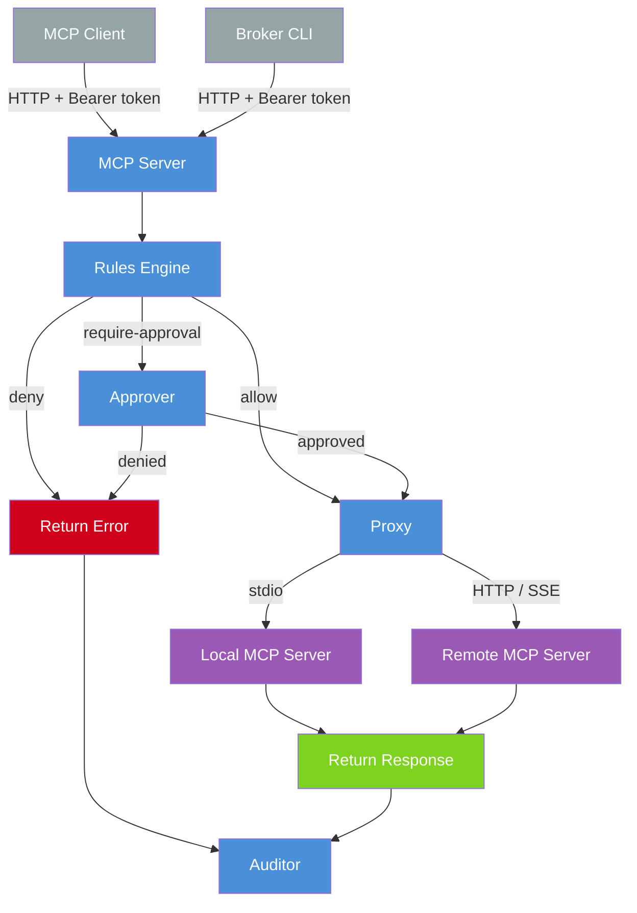

# Architecture

## Request Flow

```mermaid
flowchart TD
    Agent["MCP Client"] -->|"HTTP + Bearer token"| MCP["MCP Server"]
    CLI["Broker CLI"] -->|"HTTP + Bearer token"| MCP

    MCP --> Rules["Rules Engine"]

    Rules -->|allow| Proxy["Proxy"]
    Rules -->|deny| Error["Return Error"]
    Rules -->|require-approval| Approver["Approver"]

    Approver -->|approved| Proxy
    Approver -->|denied| Error

    Proxy -->|stdio| Git["Local MCP Server"]
    Proxy -->|HTTP / SSE| Remote["Remote MCP Server"]

    Git --> Response["Return Response"]
    Remote --> Response

    Error --> Audit["Auditor"]
    Response --> Audit

    style MCP fill:#4a90d9,color:#fff
    style Rules fill:#4a90d9,color:#fff
    style Approver fill:#4a90d9,color:#fff
    style Proxy fill:#4a90d9,color:#fff
    style Agent fill:#95a5a6,color:#fff
    style CLI fill:#95a5a6,color:#fff
    style Git fill:#9b59b6,color:#fff
    style Remote fill:#9b59b6,color:#fff
    style Audit fill:#4a90d9,color:#fff
    style Response fill:#7ed321,color:#fff
    style Error fill:#d0021b,color:#fff
```
