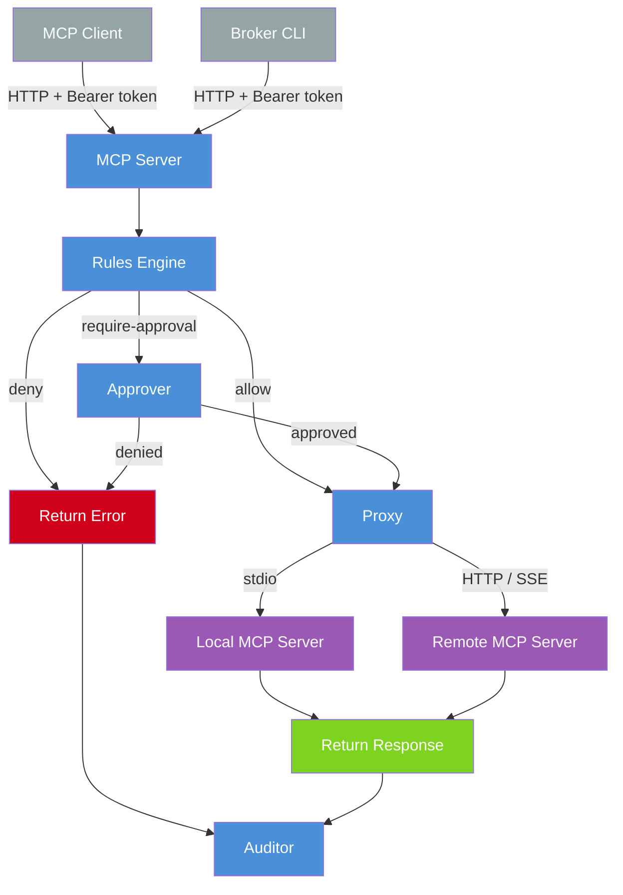

# Architecture

## Request Flow

### Pipeline stages

1. **Rules** -- Tool name matched against glob patterns, first match wins. Three verdicts: `allow`, `deny`, `require-approval`
2. **Approval** -- If required, the call blocks until a human approves or denies
3. **Proxy** -- Server Manager routes to the correct backend by tool prefix (e.g. `git.push` routes to the `git` backend)
4. **Audit** -- Every call is recorded in the audit log: tool name, arguments, verdict, approval decision, and success/error

### Entry points

- **MCP clients** connect directly to `/mcp` using standard MCP protocol over HTTP
- **Broker CLI** connects to the same `/mcp` endpoint, discovers tools at startup, and exposes them as shell commands with typed flags

### Backend providers

Providers are pluggable MCP servers connected via stdio, Streamable HTTP, or SSE. The broker discovers their tools on startup and re-exposes them with `<server>.<tool>` namespacing. Credentials stay on the host -- stdio providers like `local-git-mcp` shell out to already-authenticated host binaries.
