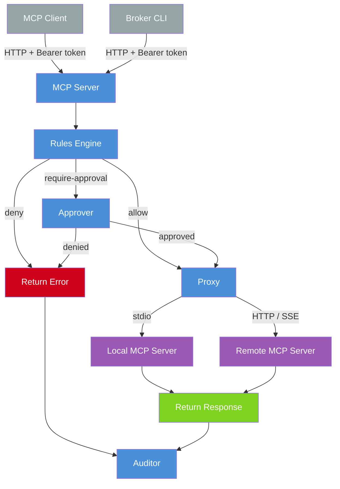

# MCP Broker

An MCP proxy that lets sandboxed agents use external tools without holding secrets.

Agents run in sandboxes with no credentials and restricted network access — but they still need to call GitHub, Jira, Slack, and other external APIs. mcp-broker runs on the host, holds the secrets, and exposes backend MCP servers through a single endpoint. Policy rules control which tools are allowed, sensitive operations require human approval via a web dashboard, and every call is audit-logged.

## How it works

```
Agent ──MCP──▶ mcp-broker ──MCP──▶ Backend servers
                  │
                  ├─ Rules engine (glob-based allow/deny/require-approval)
                  ├─ Human approval via web dashboard + optional Telegram
                  └─ SQLite audit log
```

An agent connects to mcp-broker as a single MCP server. mcp-broker connects to one or more backend MCP servers (via stdio or HTTP), discovers their tools, and re-exposes them with `<server>.<tool>` namespacing. Every tool call flows through the pipeline:

1. **Rules check** — glob patterns match tool names to verdicts (`allow`, `deny`, `require-approval`)
2. **Approval** — if the verdict is `require-approval`, the call blocks until a human approves or denies it via the web dashboard (and optionally Telegram). A configurable timeout (default 10 minutes) auto-denies if no response arrives.
3. **Proxy** — the call is forwarded to the backend server
4. **Audit** — the call, verdict, and result are recorded in SQLite

## Security

mcp-broker is designed for **local use only**. Startup refuses to bind anything but a loopback interface (`127.0.0.1`, `::1`, or `localhost`) — binding to `0.0.0.0` or a LAN IP is a hard error, not a warning. This is the load-bearing security boundary; the bearer token is defense-in-depth on top of it.

**Threat model:** Prevent other processes on your machine from calling the broker's HTTP endpoints without authorization. This covers casual/accidental access and opportunistic localhost attacks, not a determined attacker with root access to your machine.

**What auth provides:**

- A random bearer token required on every request (MCP and dashboard)
- Cookie-based session for the browser dashboard
- Constant-time token comparison to prevent timing attacks

**What auth does NOT provide:**

- Protection against an attacker who can read your filesystem (they can read the token file)
- TLS/encryption (traffic is plain HTTP on localhost)
- User accounts or role-based access — there is one token for everything
- Automatic token rotation (use `mcp-broker token rotate` to rotate manually)

**Sandboxed agents** reach the broker via Lima's user-mode networking, which forwards guest connections to `host.lima.internal:8200` to the host's loopback. Set `MCP_BROKER_ENDPOINT=http://host.lima.internal:8200` inside the sandbox.

## Quick start

```bash
# Build
make build

# Run (creates default config on first run)
./mcp-broker serve

# Dashboard URL (with auth token) is printed to stderr on startup
# MCP endpoint at http://localhost:8200/mcp (requires Bearer token)
```

## Configuration

Config lives at `~/.config/mcp-broker/config.json` (or `$XDG_CONFIG_HOME/mcp-broker/config.json`).

```json
{
  "servers": {
    "github": {
      "command": "npx",
      "args": ["-y", "@modelcontextprotocol/server-github"],
      "env": { "GITHUB_TOKEN": "$GITHUB_TOKEN" }
    },
    "github-remote": {
      "type": "sse",
      "url": "https://api.githubcopilot.com/mcp/",
      "headers": { "Authorization": "Bearer $GITHUB_TOKEN" }
    },
    "internal": {
      "type": "streamable-http",
      "url": "http://localhost:3000/mcp"
    }
  },
  "rules": [
    { "tool": "github.search_*", "verdict": "allow" },
    { "tool": "github.push*", "verdict": "require-approval" },
    { "tool": "*", "verdict": "require-approval" }
  ],
  "host": "127.0.0.1",
  "port": 8200,
  "approval_timeout_seconds": 600,
  "telegram": {
    "enabled": false,
    "token": "$TELEGRAM_BOT_TOKEN",
    "chat_id": "$TELEGRAM_CHAT_ID"
  },
  "audit": {
    "path": "~/.local/share/mcp-broker/audit.db"
  },
  "log": {
    "level": "info"
  }
}
```

### Servers

Servers is a map keyed by server name. Each name is used as a tool prefix (e.g. `github.search`).

| Field     | Description                                                                                     |
| --------- | ----------------------------------------------------------------------------------------------- |
| `command` | Command to spawn (stdio transport, default)                                                     |
| `args`    | Command arguments                                                                               |
| `env`     | Environment variables; `$VAR` and `${VAR}` references are expanded from the process environment |
| `type`    | Transport type: omit for stdio, `"streamable-http"` for Streamable HTTP, `"sse"` for SSE        |
| `url`     | URL for HTTP/SSE transport                                                                      |
| `headers` | HTTP headers; `$VAR` and `${VAR}` references are expanded from the process environment          |

### OAuth

OAuth is handled automatically. When a server responds with HTTP 401, the broker runs an OAuth flow (dynamic client registration, PKCE, browser-based authorization). Tokens are stored in the OS keychain (macOS Keychain / Linux Secret Service) and refreshed automatically. No configuration is needed.

### Mobile Approval (Telegram)

To receive approval requests on your phone and approve/deny them from anywhere, enable the Telegram notifier:

```json
{
  "approval_timeout_seconds": 600,
  "telegram": {
    "enabled": true,
    "token": "$TELEGRAM_BOT_TOKEN",
    "chat_id": "$TELEGRAM_CHAT_ID"
  }
}
```

`token` and `chat_id` support `$VAR` / `${VAR}` environment variable expansion.

**Setup:**

1. Create a bot via [@BotFather](https://t.me/BotFather) on Telegram — it gives you a bot token.
2. Start a chat with your bot, then get your chat ID by calling `https://api.telegram.org/bot<TOKEN>/getUpdates` after sending any message to it.
3. Set `TELEGRAM_BOT_TOKEN` and `TELEGRAM_CHAT_ID` in your environment and set `enabled: true` in config.

When enabled, approval requests are sent to both the web dashboard and Telegram simultaneously. Either can resolve the request — the first response wins. The web dashboard shows a live countdown; Telegram messages are updated to show the outcome after a decision is made.

### Rules

Rules are evaluated top-to-bottom, first match wins. Patterns use Go's `filepath.Match` glob syntax.

| Verdict            | Behavior                                      |
| ------------------ | --------------------------------------------- |
| `allow`            | Tool call proceeds immediately                |
| `deny`             | Tool call is rejected                         |
| `require-approval` | Tool call blocks until approved via dashboard |

Default (no matching rule): `require-approval`.

## Authentication

On first run, mcp-broker generates a random auth token and saves it to `~/.config/mcp-broker/auth-token`. All endpoints require this token.

**MCP clients** pass the token as an HTTP header:

```json
{
  "mcpServers": {
    "broker": {
      "type": "streamableHttp",
      "url": "http://localhost:8200/mcp",
      "headers": {
        "Authorization": "Bearer <token>"
      }
    }
  }
}
```

**Dashboard** opens automatically in your browser with the token. A cookie is set on first visit so you don't need to re-authenticate. If you need the URL again, it's printed to stderr every time the broker starts.

**Token rotation:**

```bash
mcp-broker token rotate    # Generate a new token (invalidates all existing sessions)
```

## How the sandbox consumes it

The sandbox needs one file from the host: the auth token (`~/.config/mcp-broker/auth-token`). The sandbox does **not** mount the host's `$HOME` — it must be copied in explicitly.

### With sandbox-manager

Add the token to `copy_paths` and the provisioning script to `scripts` in your `~/.config/sb/config.json`:

```json
{
  "copy_paths": ["~/.config/mcp-broker/auth-token"],
  "scripts": [
    "/path/to/agent-tools/mcp-broker/examples/provision/mcp-broker.sh"
  ]
}
```

The token lands at `~/.config/mcp-broker/auth-token` inside the sandbox. The provisioning script then exports `MCP_BROKER_URL=http://host.lima.internal:8200/mcp` and `MCP_BROKER_TOKEN` (read from the file at shell startup) via a marker-fenced block in `~/.bashrc`. Wire those into your agent's MCP config — for example, `claude mcp add --transport http broker "$MCP_BROKER_URL" --header "Authorization: Bearer $MCP_BROKER_TOKEN"`.

**Token rotation:** re-run `sb provision` after `mcp-broker token rotate` — `copy_paths` re-runs before `scripts`, so the new token flows through transparently. New shells pick up the updated value automatically.

### Without sandbox-manager

Copy the token file into the sandbox via whatever mechanism your setup uses, then run [`examples/provision/mcp-broker.sh`](examples/provision/mcp-broker.sh) — it writes the env-var block to `~/.bashrc`. The script targets bash; adapt the rc-file write for other shells.

## Run as a launchd agent (macOS)

To keep the broker running in the background whenever you're logged in, install it as a per-user LaunchAgent. See [docs/launchd.md](docs/launchd.md) for setup (including how to keep secrets out of the plist), install, verify, and manage steps.

## CLI

```
mcp-broker serve              # Start the broker
mcp-broker serve -v           # Enable debug logging
mcp-broker serve --log-level debug  # Same, with explicit level
mcp-broker token rotate        # Regenerate auth token
mcp-broker config path        # Print config file path
mcp-broker config refresh     # Backfill new defaults into config
mcp-broker config edit        # Open config in $EDITOR
```

## Development

```bash
make build              # Build binary to ./mcp-broker
make test               # Run tests with race detector
make test-integration   # Run integration tests (-tags=integration)
make lint               # Run golangci-lint
make fmt                # Format with goimports
make tidy               # go mod tidy + verify
make audit              # tidy + fmt + lint + test + govulncheck
```

Requires Go 1.25+. Tool dependencies (golangci-lint, goimports, govulncheck) are managed via `go tool` directives in `go.mod`.

## Architecture

See [DESIGN.md](DESIGN.md) for the full design document.

### Request flow



### Package layout

```
cmd/mcp-broker/         CLI entry point (Cobra)
internal/
  config/               JSON config load/save/refresh
  rules/                Glob-based rule engine
  audit/                SQLite audit logger
  server/               Backend MCP client (stdio, HTTP, SSE, OAuth transports)
  dashboard/            Web UI with approval flow, SSE, audit viewer
  telegram/             Telegram Bot API polling approver (opt-in)
  broker/               Core orchestrator (rules → approval → proxy → audit)
```
