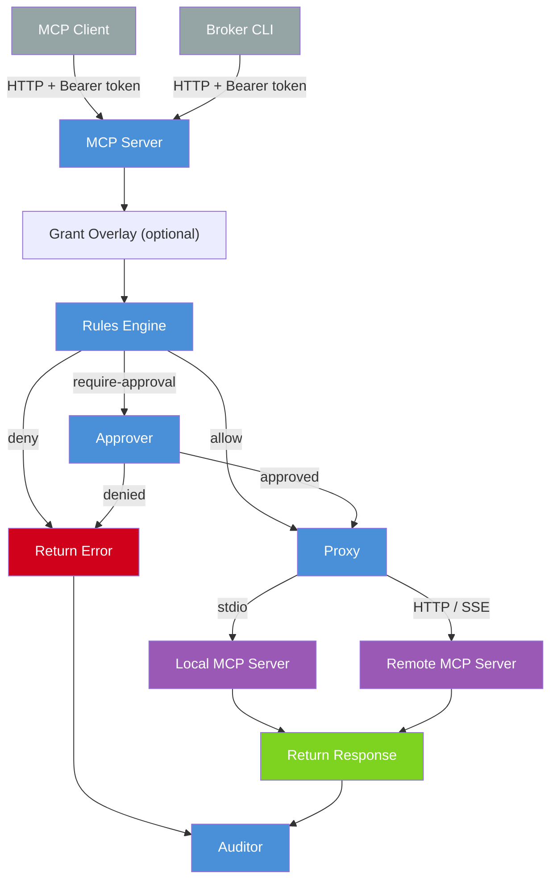

# MCP Broker

An MCP proxy that lets sandboxed agents use external tools without holding secrets.

Agents run in sandboxes with no credentials and restricted network access — but they still need to call GitHub, Jira, Slack, and other external APIs. mcp-broker runs on the host, holds the secrets, and exposes backend MCP servers through a single endpoint. Policy rules control which tools are allowed, sensitive operations require human approval via a web dashboard, and every call is audit-logged.

## How it works

```
Agent ──MCP──▶ mcp-broker ──MCP──▶ Backend servers
                  │
                  ├─ Optional grant overlay (Mcp-Broker-Grant)
                  ├─ Rules engine (glob-based allow/deny/require-approval)
                  ├─ Human approval via web dashboard + optional Telegram
                  └─ SQLite audit log
```

An agent connects to mcp-broker as a single MCP server. mcp-broker connects to one or more backend MCP servers (via stdio or HTTP), discovers their tools, and re-exposes them with `<server>.<tool>` namespacing. Every tool call flows through the pipeline:

1. **Grant overlay** — if the request supplies `Mcp-Broker-Grant`, the broker validates that durable grant token and evaluates its rules first.
2. **Base rules check** — if no grant rule matches, glob patterns match tool names to base verdicts (`allow`, `deny`, `require-approval`).
3. **Approval** — if the final verdict is `require-approval`, the call blocks until a human approves or denies it via the web dashboard (and optionally Telegram). A configurable timeout (default 10 minutes) auto-denies if no response arrives. Requests can opt out of waiting with `Mcp-Broker-Approval-Mode: reject`.
4. **Proxy** — the call is forwarded to the backend server.
5. **Audit** — the call, verdict, grant attribution, and result are recorded in SQLite.

## Security

mcp-broker is designed for **local use only**. Startup refuses to bind anything but a loopback interface (`127.0.0.1`, `::1`, or `localhost`) — binding to `0.0.0.0` or a LAN IP is a hard error, not a warning. This is the load-bearing security boundary; the bearer token is defense-in-depth on top of it.

**Threat model:** Prevent other processes on your machine from calling the broker's HTTP endpoints without authorization. This covers casual/accidental access and opportunistic localhost attacks, not a determined attacker with root access to your machine.

**What auth provides:**

- A random bearer token required on every MCP and dashboard request (`/healthz` is unauthenticated for local liveness checks)
- Cookie-based session for the browser dashboard
- Constant-time token comparison to prevent timing attacks

**What auth does NOT provide:**

- Protection against an attacker who can read your filesystem (they can read the token file)
- TLS/encryption (traffic is plain HTTP on localhost)
- User accounts or role-based access — there is one token for everything
- Automatic token rotation (use `mcp-broker token rotate` to rotate manually)

**Sandboxed agents** reach the broker via Lima's user-mode networking, which forwards guest connections to `host.lima.internal:8200` to the host's loopback. Set `MCP_BROKER_URL=http://host.lima.internal:8200/mcp` inside the sandbox.

## Quick start

```bash
# Build
make build

# Run (creates default config on first run)
./mcp-broker serve

# Dashboard URL (with auth token) is printed to stderr on startup
# MCP endpoint at http://localhost:8200/mcp (requires Bearer token)
# Liveness endpoint at http://localhost:8200/healthz returns "ok" without auth
```

## Health check

`GET /healthz` is an unauthenticated liveness check for local supervisors. It returns `200 OK` with `ok\n` when the broker HTTP server is running. It does not check backend MCP servers; degraded or exhausted backends are shown in the dashboard Tools tab instead.

## Configuration

Config lives at `~/.config/mcp-broker/config.json` (or `$XDG_CONFIG_HOME/mcp-broker/config.json`). Base policy rules live in a separate rules file, defaulting to `rules.json` alongside `config.json`.

```json
{
  "servers": {
    "github": {
      "command": "npx",
      "args": ["-y", "@modelcontextprotocol/server-github"],
      "env": { "GITHUB_TOKEN": "$GITHUB_TOKEN" }
    },
    "github-remote": {
      "type": "sse",
      "url": "https://api.githubcopilot.com/mcp/",
      "headers": { "Authorization": "Bearer $GITHUB_TOKEN" }
    },
    "internal": {
      "type": "streamable-http",
      "url": "http://localhost:3000/mcp",
      "http_timeout_seconds": 120,
      "startup_retry_count": 3,
      "startup_retry_backoff_ms": 1000,
      "startup_timeout_seconds": 10
    },
    "oauth-remote": {
      "type": "streamable-http",
      "url": "https://example.com/mcp",
      "oauth": {
        "client_id": "$MCP_OAUTH_CLIENT_ID",
        "callback_port": 3118,
        "auth_server_metadata_url": "https://example.com/.well-known/oauth-authorization-server"
      }
    }
  },
  "rules": {
    "path": "/Users/alice/.config/mcp-broker/rules.json"
  },
  "tool_patches": [
    {
      "tool": "github.search_*",
      "annotations": {
        "readOnlyHint": true,
        "destructiveHint": false,
        "idempotentHint": true,
        "openWorldHint": true
      }
    },
    { "tool": "github.delete_*", "disabled": true }
  ],
  "host": "127.0.0.1",
  "port": 8200,
  "approval_timeout_seconds": 600,
  "max_request_body_bytes": 10485760,
  "telegram": {
    "enabled": false,
    "token": "$TELEGRAM_BOT_TOKEN",
    "chat_id": "$TELEGRAM_CHAT_ID"
  },
  "audit": {
    "path": "/Users/alice/.local/share/mcp-broker/audit.db"
  },
  "grants": {
    "path": "/Users/alice/.local/share/mcp-broker/grants.db",
    "max_ttl_seconds": 604800
  },
  "log": {
    "level": "info"
  }
}
```

### Top-level settings

| Field                      | Description                                                                              |
| -------------------------- | ---------------------------------------------------------------------------------------- |
| `host`                     | Listen host. Must resolve to loopback. Defaults to `127.0.0.1`.                          |
| `port`                     | Listen port. Defaults to `8200`.                                                         |
| `approval_timeout_seconds` | Human approval timeout. Defaults to 600 seconds.                                         |
| `max_request_body_bytes`   | Maximum accepted request body size on `/mcp`. Defaults to 10 MiB; set to `0` to disable. |
| `open_browser`             | Open the dashboard in a browser on startup. Defaults to `true`.                          |
| `rules.path`               | Base policy rules file. Defaults to `rules.json` alongside the effective config file.    |
| `grants.path`              | SQLite grants DB path. Defaults to `$XDG_DATA_HOME/mcp-broker/grants.db`.                |
| `grants.max_ttl_seconds`   | Maximum mintable grant TTL. Defaults to 604800 seconds (7 days); must be positive.       |

### Reloading rules

Policy rules can be reloaded without restarting the broker or reconnecting backend MCP servers. After editing `~/.config/mcp-broker/rules.json`, send `SIGHUP` to the running process:

```bash
kill -HUP $(pgrep -x mcp-broker)
```

For the launchd setup, use:

```bash
launchctl kill HUP gui/$UID/dev.agent-tools.mcp-broker
```

Only the effective rules file is reloaded. If the reload cannot read `rules.json`, parse JSON, parse the top-level `rules` array, or compile rule argument paths/regexes, the broker logs `rules reload failed` and keeps the previously active rules. New tool calls use successfully reloaded rules; calls that already reached a policy decision, including pending approval requests, keep that decision.

Restart mcp-broker for changes to `servers`, `tool_patches`, `host`, `port`, `rules.path`, `audit.path`, `grants.path`, `grants.max_ttl_seconds`, auth token, Telegram approver settings, approval timeout, log level, `open_browser`, or `max_request_body_bytes`, and after fixing a backend that exhausted startup retries. Minted and revoked grant records take effect on the next MCP request without restart because the broker checks the grants DB per request.

### Servers

Servers is a map keyed by server name. Each name is used as a tool prefix (e.g. `github.search`).

| Field                      | Description                                                                                                                                                              |
| -------------------------- | ------------------------------------------------------------------------------------------------------------------------------------------------------------------------ |
| `command`                  | Command to spawn (stdio transport, default)                                                                                                                              |
| `args`                     | Command arguments                                                                                                                                                        |
| `env`                      | Environment variables; `$VAR` and `${VAR}` references are expanded from the process environment                                                                          |
| `type`                     | Transport type: omit for stdio, `"streamable-http"` for Streamable HTTP, `"sse"` for SSE                                                                                 |
| `url`                      | URL for HTTP/SSE transport                                                                                                                                               |
| `headers`                  | HTTP headers; `$VAR` and `${VAR}` references are expanded from the process environment                                                                                   |
| `oauth`                    | Optional OAuth client settings for HTTP/SSE backends that require a fixed client ID, client secret, scopes, or callback port.                                            |
| `http_timeout_seconds`     | Streamable HTTP backend request/stream timeout. Defaults to 120 seconds when omitted.                                                                                    |
| `startup_retry_count`      | Startup retries after the first connect or `tools/list` attempt. Defaults to 3. Set `0` for one attempt only. Negative values and values above 1000 are invalid.         |
| `startup_retry_backoff_ms` | Fixed delay between startup attempts. Defaults to 1000 ms. Set `0` for no delay. Negative values are invalid.                                                            |
| `startup_timeout_seconds`  | Per-attempt startup timeout for connect and initial `tools/list`. Defaults to 10 seconds. Set `0` to disable this startup-specific timeout. Negative values are invalid. |

Streamable HTTP backends automatically recreate their MCP client and retry once when a backend restart or session expiry invalidates the current session; the broker itself does not need to be restarted. Startup retry settings are per backend and apply independently to the connect and initial `tools/list` phases. Worst-case serial startup delay is roughly the sum, across configured backends, of up to `2 * ((startup_retry_count + 1) * startup_timeout_seconds + startup_retry_count * startup_retry_backoff_ms)`, plus backend work that is not bounded when `startup_timeout_seconds` is `0`. `startup_timeout_seconds` is intentionally not the timeout for interactive OAuth: startup and runtime browser authorization flows use the broker's parent context with a dedicated five-minute limit, while the immediate post-authorization handshake uses the parent context and transport timeout. `http_timeout_seconds` still controls normal Streamable HTTP backend requests after startup; it is not the startup retry timeout.

If a backend exhausts startup retries, mcp-broker logs the failure, continues serving MCP and dashboard endpoints with the remaining healthy backends, and shows the failed backend in the dashboard Tools tab with its failed phase, attempt count, and concise error. Runtime rediscovery is not implemented: after fixing an exhausted backend, restart mcp-broker to discover its tools.

### OAuth

OAuth is handled automatically. When a server responds with HTTP 401, the broker runs an OAuth flow (PKCE, browser-based authorization). For servers that support dynamic client registration, no OAuth configuration is needed: the broker registers a client and stores that client registration plus tokens in the OS keychain (macOS Keychain / Linux Secret Service).

Servers that do not support dynamic client registration can provide fixed OAuth client settings:

```json
{
  "servers": {
    "oauth-remote": {
      "type": "streamable-http",
      "url": "https://example.com/mcp",
      "oauth": {
        "client_id": "$MCP_OAUTH_CLIENT_ID",
        "callback_port": 3118,
        "auth_server_metadata_url": "https://example.com/.well-known/oauth-authorization-server"
      }
    }
  }
}
```

Supported `oauth` fields are `client_id`, `client_secret`, `callback_port`, `scopes`, and `auth_server_metadata_url`. `client_id`, `client_secret`, and `auth_server_metadata_url` support `$VAR` / `${VAR}` expansion from the process environment. `callback_port` controls the local redirect URI `http://localhost:<port>/callback`; when omitted, the broker uses a deterministic per-server port.

Interactive OAuth is deliberately exempt from `startup_timeout_seconds` and from repeated startup retries. Startup and runtime browser authorization flows instead have a dedicated five-minute limit under the broker's parent context, so a per-attempt startup timeout does not interrupt login and an abandoned flow cannot wait indefinitely. If the OAuth flow times out, is cancelled, or is denied, that backend is marked failed and shown in the dashboard.

If a backend's cached login goes stale — for example after the upstream rotates its OAuth client registration and tool calls start failing with authorization errors — clear it with `mcp-broker logout <server>`. This removes the server's stored token and client registration from the keychain; the next call triggers a fresh OAuth flow.

### Mobile Approval (Telegram)

To receive approval requests on your phone and approve/deny them from anywhere, enable the Telegram notifier:

```json
{
  "approval_timeout_seconds": 600,
  "telegram": {
    "enabled": true,
    "token": "$TELEGRAM_BOT_TOKEN",
    "chat_id": "$TELEGRAM_CHAT_ID"
  }
}
```

`token` and `chat_id` support `$VAR` / `${VAR}` environment variable expansion.

**Setup:**

1. Create a bot via [@BotFather](https://t.me/BotFather) on Telegram — it gives you a bot token.
2. Start a chat with your bot, then get your chat ID by calling `https://api.telegram.org/bot<TOKEN>/getUpdates` after sending any message to it.
3. Set `TELEGRAM_BOT_TOKEN` and `TELEGRAM_CHAT_ID` in your environment and set `enabled: true` in config.

When enabled, approval requests are sent to both the web dashboard and Telegram simultaneously. Either can resolve the request — the first response wins. The web dashboard shows a live countdown; Telegram messages are updated to show the outcome after a decision is made. Dashboard denials can include an optional reason, returned to the agent as `denied by user: <reason>`; Telegram denials are binary and return `denied by user`.

### Rules

Base policy rules live in `~/.config/mcp-broker/rules.json` by default, or the file named by `rules.path` in `config.json`. The legacy top-level `rules_path` field remains accepted; if both fields are present, `rules.path` wins. Running `mcp-broker config refresh` rewrites the legacy field in the canonical nested form. The canonical rules file shape is:

```json
{
  "rules": [
    { "tool": "github.search_*", "verdict": "allow" },
    { "tool": "github.push*", "verdict": "require-approval" },
    { "tool": "*", "verdict": "require-approval" }
  ]
}
```

Rules are evaluated top-to-bottom, first match wins. Patterns use Go's `filepath.Match` glob syntax.

| Verdict            | Behavior                                      |
| ------------------ | --------------------------------------------- |
| `allow`            | Tool call proceeds immediately                |
| `deny`             | Tool call is rejected                         |
| `require-approval` | Tool call blocks until approved via dashboard |

Default (no matching rule): `require-approval`. On first run, mcp-broker creates `rules.json` with a catch-all `require-approval` rule. Existing configs with legacy embedded `rules` are migrated into `rules.json` when that file is missing. If both legacy embedded rules and `rules.json` exist, `rules.json` is authoritative and the legacy rules are ignored with a warning. Denials are returned to agents as MCP tool errors: `denied by rule`, `denied by rule: <reason>`, `denied by user`, `denied by user: <reason>`, or `denied by timeout`.

The approval timeout is separate from `http_timeout_seconds`: approval waiting can last up to `approval_timeout_seconds`, then approved Streamable HTTP backend calls are bounded by the backend's HTTP timeout.

#### Request approval mode

MCP tool call requests may include `Mcp-Broker-Approval-Mode` to control what happens when a rule returns `require-approval`:

| Header value | Behavior                                                     |
| ------------ | ------------------------------------------------------------ |
| `wait`       | Default. Queue the call for dashboard/Telegram approval.     |
| `reject`     | Do not queue approval. Return an MCP tool error immediately. |

`reject` does not bypass rules. `allow` and `deny` verdicts behave normally; only `require-approval` changes. Rejected calls are audited with verdict `require-approval`, approval `false`, denial reason `approval-mode: reject`, and appear in the dashboard audit table as `rejected`.

### Grants

Grants are temporary bearer tokens that prepend a small rule set to the normal policy for one request. They are useful when you want to intentionally allow or deny a narrow workflow for a bounded time without editing the base rules. Grants are authorization overlays, not authentication: clients must still send the normal `Authorization: Bearer <broker-token>` header.

Mint a grant offline with a required name, TTL, and JSON rules file:

```bash
mcp-broker grant mint --name release-window --ttl 2h --rules-file grant-rules.json
```

The rules file may be either a bare array of normal rule objects or an object with a top-level `rules` array:

```json
{
  "rules": [
    {
      "tool": "github.create_pull_request",
      "verdict": "allow",
      "reason": "release window"
    },
    { "tool": "git.push", "verdict": "require-approval" }
  ]
}
```

The full token is printed exactly once by `grant mint`; store it securely. The grants DB stores only a SHA-256 token hash plus a short display fingerprint, never the raw token. `grant list`, `grant revoke`, dashboard APIs, and audit rows show metadata such as grant ID, name, fingerprint, status, timestamps, and compact rules, but not the token or full hash.

Use a grant on an MCP tool call by adding exactly one header:

```text
Authorization: Bearer <broker-token>
Mcp-Broker-Grant: <grant-token>
```

Duplicate, empty, comma-combined, malformed, unknown, expired, and revoked grant headers fail closed before approval or proxying. Valid grants evaluate first. If a grant rule matches, its verdict is final and may intentionally shadow a base rule, including a base `deny`; if no grant rule matches, the broker falls through to base rules. `Mcp-Broker-Approval-Mode: reject` is applied only after this final verdict is selected, so it only changes final `require-approval` decisions whether they came from grant or base rules.

List and revoke retained grants offline:

```bash
mcp-broker grant list
mcp-broker grant revoke <grant-id-or-fingerprint>
```

Revocation is durable and idempotent, and a running broker observes it on the next MCP request. Expired and revoked grants are retained for visibility. The dashboard Grants tab is read-only in v1; grant creation and revocation remain CLI-only. Audit records include grant ID/name/fingerprint/status and rule source (`grant`, `base`, or `none/default`) so you can distinguish grant matches from grant fallthrough to base policy.

#### Argument matching

Deny rules may include an optional `reason` field. When that rule rejects a call, the agent sees `denied by rule: <reason>` and the reason is recorded in audit.

```json
{
  "tool": "github.delete_*",
  "verdict": "deny",
  "reason": "repository deletion is disabled"
}
```

Rules can optionally constrain on argument values using the `args` field. All patterns must match (AND semantics) for a rule to fire.

```json
{
  "rules": [
    {
      "tool": "local-git.push",
      "verdict": "allow",
      "args": [{ "path": "remote", "match": "origin" }]
    },
    {
      "tool": "local-git.push",
      "verdict": "deny",
      "args": [{ "path": "commit.message", "match": { "regex": "^chore:" } }]
    },
    { "tool": "local-git.push", "verdict": "require-approval" }
  ]
}
```

`path` is a dot-separated field path (e.g. `remote`, `commit.message`, `command.0`). `match` is either a bare string for exact matching or `{"regex": "<RE2 pattern>"}` for regex matching. If a path cannot be resolved (missing key, wrong type, out-of-range index), the rule does not match and evaluation continues.

Note: regexes are not auto-anchored — use `^...$` for full-match semantics.

### Tool patches

Tool patches are optional load-time transforms for discovered tools. They match the broker-prefixed tool name, such as `github.search_code`, using the same `filepath.Match` glob syntax as rules. Patches are evaluated top-to-bottom and only the first matching patch applies.

```json
{
  "tool_patches": [
    {
      "tool": "github.search_*",
      "annotations": {
        "title": "GitHub search",
        "readOnlyHint": true,
        "destructiveHint": false
      }
    },
    { "tool": "github.delete_*", "disabled": true }
  ]
}
```

`annotations` merges field-by-field with upstream MCP tool annotations: fields present in the patch override upstream values, omitted fields are preserved, and missing upstream annotations are created. Supported fields are `title`, `readOnlyHint`, `destructiveHint`, `idempotentHint`, and `openWorldHint`.

`disabled: true` removes matching tools from the broker registry. Disabled tools do not appear in MCP `tools/list` or the dashboard and cannot be called through the broker.

## Authentication

On first run, mcp-broker generates a random auth token and saves it to `~/.config/mcp-broker/auth-token`. All endpoints require this token.

**MCP clients** pass the token as an HTTP header:

```json
{
  "mcpServers": {
    "broker": {
      "type": "streamableHttp",
      "url": "http://localhost:8200/mcp",
      "headers": {
        "Authorization": "Bearer <token>"
      }
    }
  }
}
```

Background clients that must not wait for human approval can add `Mcp-Broker-Approval-Mode: reject` to individual tool calls, or set it as a default HTTP header for that client.

**Dashboard** opens automatically in your browser with the token. On first visit, the broker stores the token in an `HttpOnly`, `SameSite=Strict` cookie, then redirects to the same dashboard URL with the `token` query parameter removed. If you need the URL again, it's printed to stderr every time the broker starts.

**Token rotation:**

```bash
mcp-broker token rotate    # Generate a new token (invalidates all existing sessions)
```

## How the sandbox consumes it

The sandbox needs one file from the host: the auth token (`~/.config/mcp-broker/auth-token`). The sandbox does **not** mount the host's `$HOME` — it must be copied in explicitly.

### With sandbox-manager

Add the token to `copy_paths` and the provisioning script to `scripts` in your `~/.config/sb/config.json`:

```json
{
  "copy_paths": ["~/.config/mcp-broker/auth-token"],
  "scripts": [
    "/path/to/agent-tools/mcp-broker/examples/provision/configure-mcp-broker.sh"
  ]
}
```

The token lands at `~/.config/mcp-broker/auth-token` inside the sandbox. The provisioning script then exports `MCP_BROKER_URL=http://host.lima.internal:8200/mcp` and `MCP_BROKER_TOKEN` (read from the file at shell startup) via a marker-fenced block in `~/.bashrc`. Wire those into your agent's MCP config — for example, `claude mcp add --transport http broker "$MCP_BROKER_URL" --header "Authorization: Bearer $MCP_BROKER_TOKEN"`.

**Token rotation:** re-run `sb provision` after `mcp-broker token rotate` — `copy_paths` re-runs before `scripts`, so the new token flows through transparently. New shells pick up the updated value automatically.

### Without sandbox-manager

Copy the token file into the sandbox via whatever mechanism your setup uses, then run [`examples/provision/configure-mcp-broker.sh`](examples/provision/configure-mcp-broker.sh) — it writes the env-var block to `~/.bashrc`. The script targets bash; adapt the rc-file write for other shells.

## Run as a launchd agent (macOS)

To keep the broker running in the background whenever you're logged in, install it as a per-user LaunchAgent. See [docs/launchd.md](docs/launchd.md) for setup (including how to keep secrets out of the plist), install, verify, and manage steps.

## CLI

```
mcp-broker serve              # Start the broker
mcp-broker serve -v           # Enable debug logging
mcp-broker serve --log-level debug  # Same, with explicit level
mcp-broker token rotate        # Regenerate auth token
mcp-broker grant mint --name NAME --ttl 1h --rules-file rules.json
mcp-broker grant list          # List retained active/expired/revoked grants
mcp-broker grant revoke ID     # Revoke by grant ID or fingerprint
mcp-broker logout <server>     # Clear a backend's cached OAuth credentials
mcp-broker config path        # Print config file path
mcp-broker config refresh     # Backfill new defaults into config and ensure rules file exists
mcp-broker config edit        # Open config in $EDITOR
mcp-broker rules path         # Print rules file path
mcp-broker rules refresh      # Write rules file in canonical form
mcp-broker rules edit         # Open rules file in $EDITOR
```

## Development

```bash
make build              # Build binary to ./mcp-broker
make test               # Run tests with race detector
make test-integration   # Run integration tests (-tags=integration)
make lint               # Run golangci-lint
make fmt                # Format with goimports
make tidy               # go mod tidy + verify
make audit              # tidy + fmt + lint + test + govulncheck
```

Requires Go 1.25+. Tool dependencies (golangci-lint, goimports, govulncheck) are managed via `go tool` directives in `go.mod`.

## Architecture

See [DESIGN.md](DESIGN.md) for the full design document.

### Request flow


```mermaid
flowchart TD
    Agent["MCP Client"] -->|"HTTP + Bearer token"| MCP["MCP Server"]
    CLI["Broker CLI"] -->|"HTTP + Bearer token"| MCP

    MCP --> Grants["Grant Overlay (optional)"]
    Grants --> Rules["Rules Engine"]

    Rules -->|allow| Proxy["Proxy"]
    Rules -->|deny| Error["Return Error"]
    Rules -->|require-approval| Approver["Approver"]

    Approver -->|approved| Proxy
    Approver -->|denied| Error

    Proxy -->|stdio| Git["Local MCP Server"]
    Proxy -->|HTTP / SSE| Remote["Remote MCP Server"]

    Git --> Response["Return Response"]
    Remote --> Response

    Error --> Audit["Auditor"]
    Response --> Audit

    style MCP fill:#4a90d9,color:#fff
    style Rules fill:#4a90d9,color:#fff
    style Approver fill:#4a90d9,color:#fff
    style Proxy fill:#4a90d9,color:#fff
    style Agent fill:#95a5a6,color:#fff
    style CLI fill:#95a5a6,color:#fff
    style Git fill:#9b59b6,color:#fff
    style Remote fill:#9b59b6,color:#fff
    style Audit fill:#4a90d9,color:#fff
    style Response fill:#7ed321,color:#fff
    style Error fill:#d0021b,color:#fff
```

### Package layout

```
cmd/mcp-broker/         CLI entry point (Cobra)
internal/
  config/               JSON config load/save/refresh
  rules/                Glob-based rule engine
  audit/                SQLite audit logger
  server/               Backend MCP client (stdio, HTTP, SSE, OAuth transports)
  dashboard/            Web UI with approval flow, SSE, audit viewer
  telegram/             Telegram Bot API polling approver (opt-in)
  broker/               Core orchestrator (rules → approval → proxy → audit)
```
